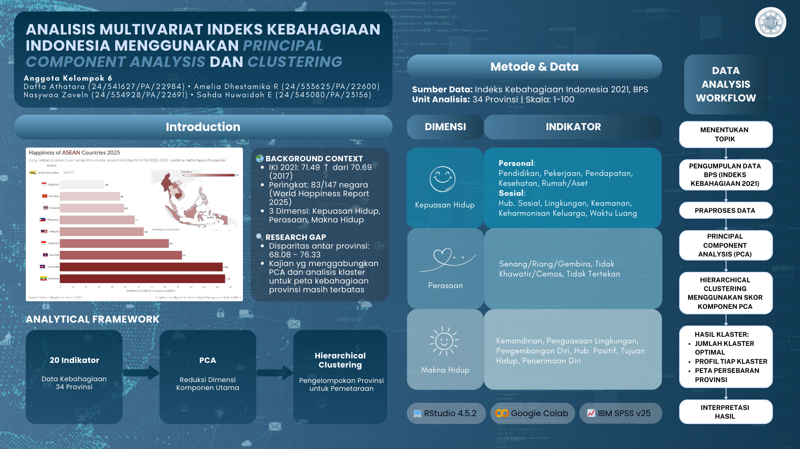
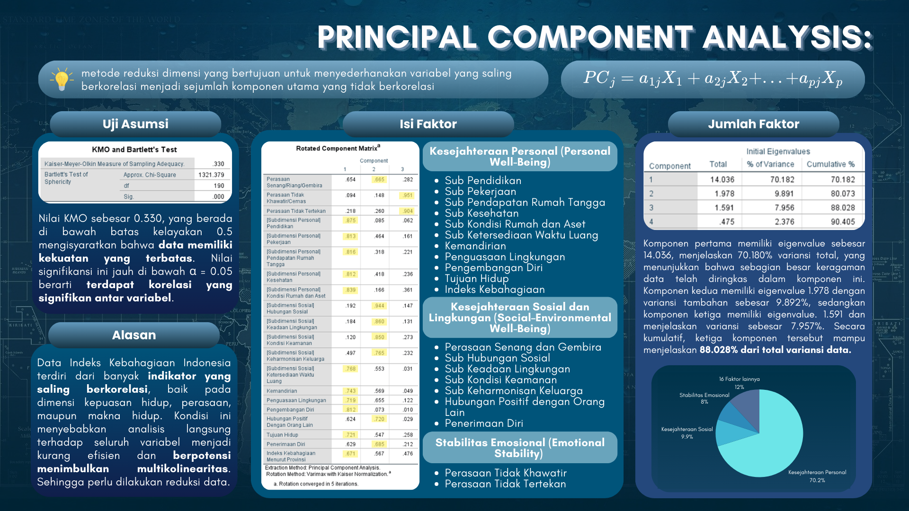
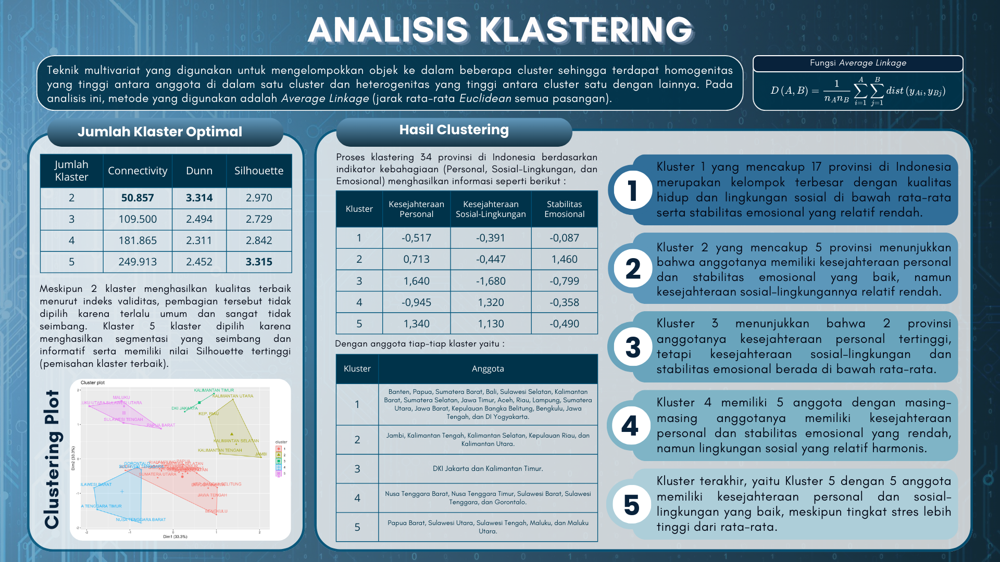
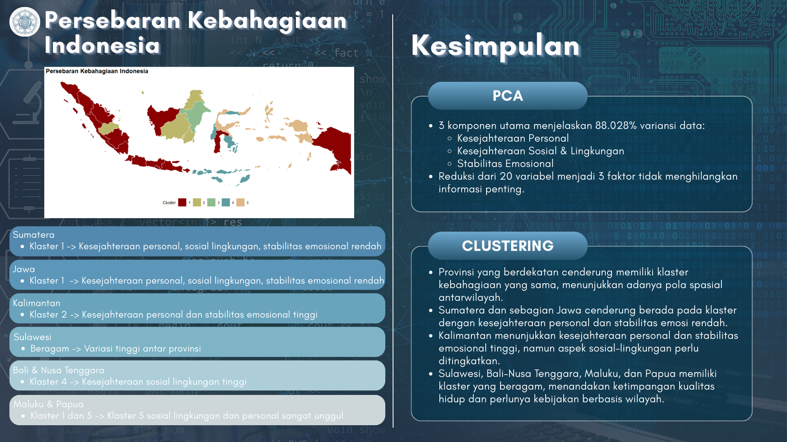

# Analisis Multivariat Indeks Kebahagiaan Indonesia  

Proyek ini bertujuan untuk menganalisis **Indeks Kebahagiaan Indonesia (IKI)** menggunakan pendekatan statistika multivariat, khususnya **Principal Component Analysis (PCA)** dan **Hierarchical Clustering**. Analisis dilakukan untuk mengidentifikasi struktur laten indikator kebahagiaan serta memetakan provinsi di Indonesia berdasarkan tingkat kebahagiaan masyarakat.

Proyek ini disusun sebagai bagian dari **Project Akhir Mata Kuliah Statistika Multivariat Terapan**  
Program Studi Statistika, Departemen Matematika  
Fakultas MIPA, Universitas Gadjah Mada.

---

## 📌 Project Overview

Kebahagiaan masyarakat merupakan indikator penting dalam menilai kualitas hidup dan menjadi acuan dalam perumusan kebijakan pembangunan berkelanjutan. Di Indonesia, tingkat kebahagiaan diukur melalui **Indeks Kebahagiaan Indonesia (IKI)** yang mencakup tiga dimensi utama:

- 😊 Kepuasan Hidup  
- 💭 Perasaan  
- 🌱 Makna Hidup  

Melalui pendekatan multivariat, penelitian ini bertujuan untuk:
- Mereduksi banyaknya indikator kebahagiaan menjadi komponen utama
- Mengelompokkan provinsi di Indonesia berdasarkan karakteristik kebahagiaannya
- Mengidentifikasi pola geografis kebahagiaan antarwilayah

---

## 📊 Data & Variabel

- Unit observasi: 34 Provinsi di Indonesia
- Jumlah variabel awal: 20 indikator kebahagiaan
- Sumber data: Indeks Kebahagiaan Indonesia (BPS)

---

## 🔍 Methodology

Metode analisis yang digunakan dalam proyek ini meliputi:

### 1️⃣ Principal Component Analysis (PCA)
Digunakan untuk mereduksi 20 variabel menjadi beberapa komponen utama yang lebih representatif.

Hasil PCA menghasilkan 3 komponen utama:
- **Kesejahteraan Personal**
- **Kesejahteraan Sosial dan Lingkungan**
- **Stabilitas Emosional**

Ketiga komponen tersebut mampu menjelaskan **88,03% variansi total** sehingga cukup representatif dalam menggambarkan struktur indikator kebahagiaan.

### 2️⃣ Hierarchical Clustering
Skor komponen utama hasil PCA digunakan sebagai input untuk melakukan pengelompokan provinsi menggunakan metode Hierarchical Clustering.

---

## 🏁 Results & Insights

- Terbentuk klaster provinsi dengan karakteristik kebahagiaan yang berbeda
- Ditemukan pola klaster yang cenderung konsisten secara geografis

Hasil ini memberikan pemetaan kebahagiaan yang lebih holistik dan dapat menjadi dasar perumusan kebijakan pembangunan yang lebih terfokus dan merata antarwilayah.

---

## 🔧 Tools & Software

- R / Python (sesuai implementasi)
- Statistik Multivariat
- PCA
- Hierarchical Clustering
- Data Visualization

---

## 🖼 Image Overview

  

  

  

  

---

## 👩‍🎓 Authors

- Sahda Huwaidah Estiningtyas 
  [24/545080/PA/23156]  

- Amelia Dhestamika Rafani  
  [24/533625/PA/22600]

- Daffa Athatara  
  [24/541627/PA/22984]

- Nasywaa Zaveln  
  [24/532948/PA/22691]

Program Studi Statistika  
Departemen Matematika, Fakultas MIPA  
Universitas Gadjah Mada, Sleman, Indonesia

---

## 🔑 Keywords

Indeks Kebahagiaan, Statistika Multivariat, PCA, Clustering, Hierarchical Clustering, Provinsi Indonesia
